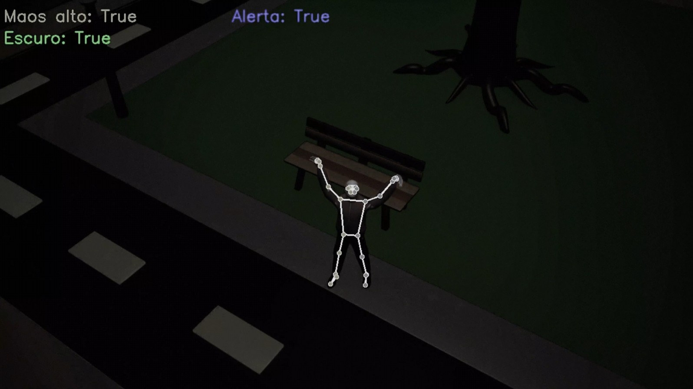

## 👤 Integrantes

- **RM 99389:** Victor Flávio Demarchi viana

- **RM 550695:** Gabriel Ferla

- **RM 97158:** Lucas Moreno Matheus

## 🧩 Descrição do Problema
Durante apagões urbanos, a ausência de iluminação pública compromete a segurança dos cidadãos, especialmente em áreas públicas durante a noite, como parques, ruas e praças. Nessa condição de escuridão total, torna-se difícil identificar situações de emergência, como pessoas desorientadas, ameaçadas ou que precisam de cuidados especiais, que precisam de socorro imediato. Em casos assim, uma resposta rápida pode evitar acidentes ou até salvar vidas.

**Problema-chave:** Como detectar automaticamente quando uma pessoa, no escuro total, está pedindo ajuda, sem depender de dispositivos móveis, voz ou outros recursos tecnológicos?

## 💡 Visão Geral da Solução
A proposta é um sistema de visão computacional desenvolvido em Python e MediaPipe, imbutido nas câmeras de vigilância com visão noturna (infravermelho) do Smart Sampa, para monitorar ambientes públicos durante apagões e acionar um alarme de emergência automaticamente quando uma pessoa levanta as mãos em um gesto claro pedido de ajuda.

**Componentes principais da solução:**

**1. Captura de Vídeo por Câmeras com Visão Noturna:**

* Utiliza câmeras infravermelhas já presentes na rede Smart Sampa, possuindo baterias para se manterem ligadas mesmo na ausência de energia elétrica da rede pública.

* O sistema processa e detecta poses em tempo real, mesmo na ausência de luz visível.

* A solução é projetada para funcionar somente na escuridão total.

**2. Detecção de Pessoas e Posição Corporal (Pose Landmark Detection):**

* Usa a biblioteca **MediaPipe Pose** para identificar e rastrear posturas humanas.

* Foca na detecção da posição relativa das mãos em relação ao cotovelo e ombros.

**3. Reconhecimento do Gesto de Pedido de Ajuda:**

* Define um padrão: ambas as mãos esticadas acima da cabeça por alguns segundos (ex: 2–3s).

* Evita ao máximo gestos isolados ou acidentais, reduzindo falsos positivos.

**4. Disparo do Alarme de Emergência:**

Ao confirmar o gesto, o sistema envia:

* Um alerta visual/sonoro local (se disponível).

* Uma notificação à central de monitoramento do Smart Sampa.

* (Opcional) Geolocalização do evento para resposta rápida da equipe de segurança pública.

## 🛠️ Instruções de Uso
Para utilizar a solução é necessária uma câmera conectada ao microcontrolador ou computador, e certifique-se de que as seguintes dependências estejam instaladas:

* **Python**

* **MediaPipe** (Pycharm: instalar pacote "mediapipe", CMD: executar o comando "python -m pip install mediapipe")

* **NumPy** (Pycharm: instalar pacote "numpy", CMD: executar o comando "python -m pip install numpy")

* **OpenCV (CV2)** (Pycharm: instalar pacote "opencv-python", CMD: executar o comando "python -m pip install opencv-python")

Após a instalação das dependências, execute o arquivo `blackout_assistance.py` pelo tempo em que desejar manter a solução ativa. 

Obs: Certifique-se que todos os arquivos se encontram na mesma pasta e de permitir o acesso às imagens das câmeras pelo programa.

## 🔗 Link do video:

* https://youtu.be/QpKFadn6Tmw

